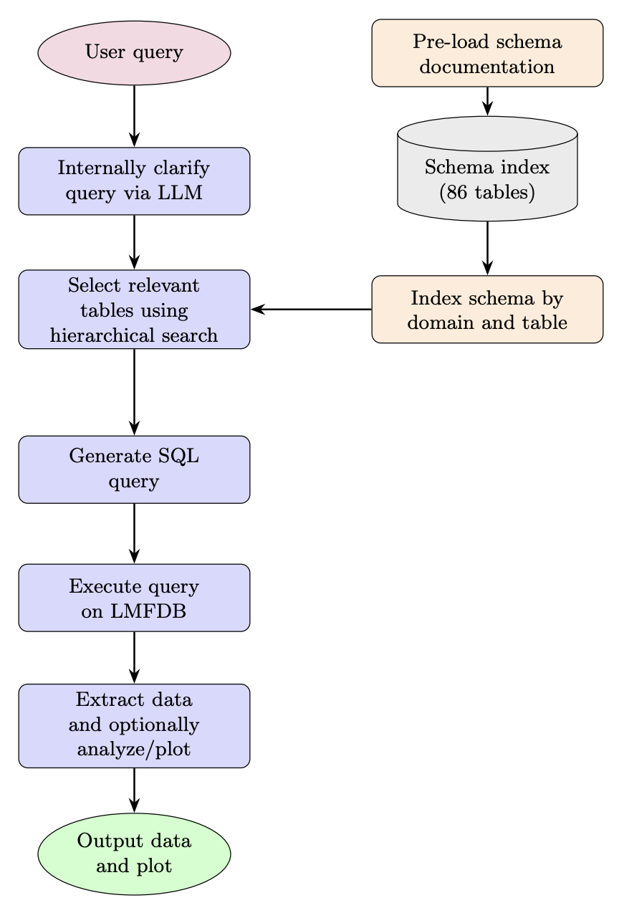

# Conductor 🔋

Conductor is a natural language interface to the [LMFDB](https://www.lmfdb.org) (L-functions and Modular Forms Database). It translates mathematical questions into SQL, executes them against the LMFDB PostgreSQL database, and returns structured data with optional exploratory analysis and plots. It is designed to make the rich collection of mathematical data in the LMFDB more accessible for exploration, research, and teaching.

Given a query in plain English, Conductor identifies and retrieves the relevant mathematical data from the database, and can optionally summarize, analyze, or visualize the results at the user's convenience. This allows users to explore the LMFDB without needing to learn its internal structure or write database queries by hand.

For instance, a mathematician can directly ask Conductor the following questions:

> **Can you plot the regulator against the conductor for the rank-1 elliptic curves over Q with conductor under 10,000 on a log-log scale?**

> **Plot the real period vs the analytic order of Sha for elliptic curves of rank 2 with conductor under 5,000.**

> **Which semistable elliptic curves have prime conductor under 500 and non-trivial torsion? Show me the distribution of torsion subgroup structures.**

> **I'm interested in the relationship between regulator and discriminant for totally real cubic fields of class number 1 — can you pull those and plot them on a log-log scale?**

> **Give me a table of the weight-2 newforms with CM at squarefree levels under 500.**

By utilizing modern methods in prompt engineering, text-to-SQL, and AI-powered data analysis, Conductor allows users to spend less time navigating databases and more time exploring mathematical questions.

# Setup 

## Prerequisites 🟡
- Python 3.12+
- Access to the LMFDB PostgreSQL mirror (default: `devmirror.lmfdb.xyz`)

## Installation 🔌
TBD.

# Architecture 🏛️
# Architecture 🏛️

The backend of Conductor consists of a seven-stage FastAPI pipeline with error handling. We utilize Claude Haiku 4.5 for classification, else we use Claude Sonnet 4.6, which handles user interactions and more complicated tasks. It works as follows:
0. An intent classifier determines whether the incoming message is a mathematical query or a conversational message. Conversational messages receive a natural response and skip all subsequent stages.
1. An LLM-as-judge assesses query precision before any database interaction. If the query is ambiguous, it asks a followup question. If clear, it returns a refined restatement passed to all subsequent stages.
2. A lightweight object resolution stage fires when the query references a concrete mathematical object  and resolves it to a database identifier. If no concrete object is found, the query passes through unchanged.
3. Our LLM maps the query to a list of relevant LMFDB table names using a two-layer hierarchical schema index (16 domains, 86 tables).
4. Our LLM produces a validated SQL query using the tables identified in Stage 3. Correctness is enforced by using our preloaded schema as a ground truth.
5. We run the SQL over a read-only SQLAlchemy connection with a 15-second timeout, returning a pandas DataFrame.
6. *(optional)* We translate a follow-up natural language instruction into Python. Plots and subsequent data analysis are captured in-memory and returned as base64-encoded PNGs alongside the generated code.

# Database coverage 📊
The LMFDB contains the following 86 tables across 16 mathematical domains:
| Domain | Tables |
|--------|--------|
| Classical modular forms | mf_newforms, mf_gamma1, mf_stark, etc. |
| Maass forms | maass_newforms, maass_rigor.|
| Hilbert / Bianchi / Siegel modular forms | hmf_forms, bmf_forms, smf_samples. |
| Other modular forms | halfmf_forms, modlmf_forms, modlgal_reps. |
| L-functions | lfunc_lfunctions, lfunc_search, lfunc_instances. |
| Elliptic curves over Q | ec_curvedata, ec_mwbsd, ec_localdata, ec_classdata, etc. |
| Elliptic curves over number fields | ec_nfcurves. |
| Genus-2 curves | g2c_curves, g2c_endomorphisms, etc. |
| Abelian varieties over finite fields | av_fq_isog, av_fq_endalg_data, av_fq_endalg_factors. |
| Number fields | nf_fields, nf_fields_extra, nf_fields_reflex. |
| Local fields and finite fields | lf_fields, lf_families, fq_fields. |
| Artin representations | artin_reps, artin_field_data. |
| Dirichlet characters | char_dirichlet. |
| Hypergeometric motives | hgm_families, hgm_motives, hgm_monodromy, hgm_euler_survey. |
| Modular curves | modcurve_models, modcurve_points, modcurve_modelmaps. |
| Groups | gps_groups, gps_transitive, gps_st, etc. |
| Lattices and other | lat_lattices, cluster_pictures, hgcwa_passports, etc. |

## Project structure 🏗️
```
conductor/
├── main.py                  # FastAPI app, endpoints, auth, rate limiting
├── pipeline/
│   ├── router.py            # Stage 2: NL query → table names
│   ├── sql_gen.py           # Stage 3: query + tables → validated SQL
│   ├── executor.py          # Stage 4: SQL → DataFrame
│   ├── analysis.py          # Stage 5: instruction + DataFrame → plot
│   └── chat.py              # Orchestrator: session state, error handling
├── schema/
│   ├── lmfdb_schema.json    # Full schema: 86 tables, 2,006 columns
│   └── routing_index.json   # Two-layer routing index
├── prompts/
│   ├── sql_prompt.txt       # SQL generation system prompt
│   ├── analysis_prompt.txt  # Analysis generation system prompt
│   └── analysis_style.txt   # Plot style guide
├── tests/
│   ├── test_router.py
│   ├── test_sql_gen.py
│   ├── test_executor.py
│   └── test_analysis.py
├── .env.example
├── requirements.txt
└── README.md
```

# Limitations 🟥
- The server connects to devmirror.lmfdb.xyz, which may only have partial coverage of the full LMFDB. Moreover, since the LMFDB itself is not fully comprehensive, some data may be unavailable.
- Queries are subject to API rate limits. Therefore, responses may slow under heavy load.
-  Conductor is under active development, and thus you may encounter occasional errors or unexpected behaviour. If you do, please open a GitHub issue to report it. 

# Acknowledgements 🌲
This work would be impossible without the collective work of hundreds of mathematicians in computing and curating the data which is available on the LMFDB. See [lmfdb.org/acknowledgment](https://www.lmfdb.org/acknowledgment) for a list of contributors.
